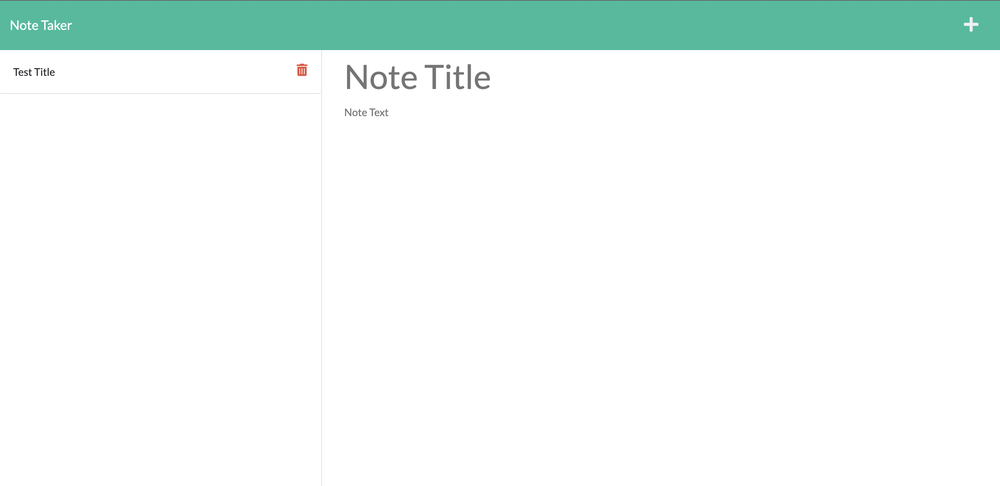

# Challenge #11 - Note Taker

## Description

    This project was about using the Express npm package to write the routes and connect the front (pre-written) end to the backend database. The user is able to click on the note's body to enter text and create new notes or update pre-existing notes. 

## Experience Gained

    After returning to this challenge a few weeks later, it was not particularly difficult. Writing routes seems much easier after understanding how they connect to more complicated challenges (like Challenge #13). However, it took a few minutes to review how they were written without a MySQL database creating the unique id's automatically.

## GitHub Links (Repository and Demo Video)

    The repository link: https://github.com/ekball/C11-Note-Taker

    The demo video link: https://watch.screencastify.com/v/Q9Imj9urCIiHLs08z6LB

## Demo README

